<div align="center">
  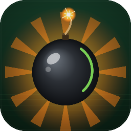
  <h1>BlastZone Arena</h1>
  <p>A modern open-source arena game inspired by classic bomb-placement games<br>built with <strong>Rust</strong> and <strong>Bevy 0.15</strong>.</p>
  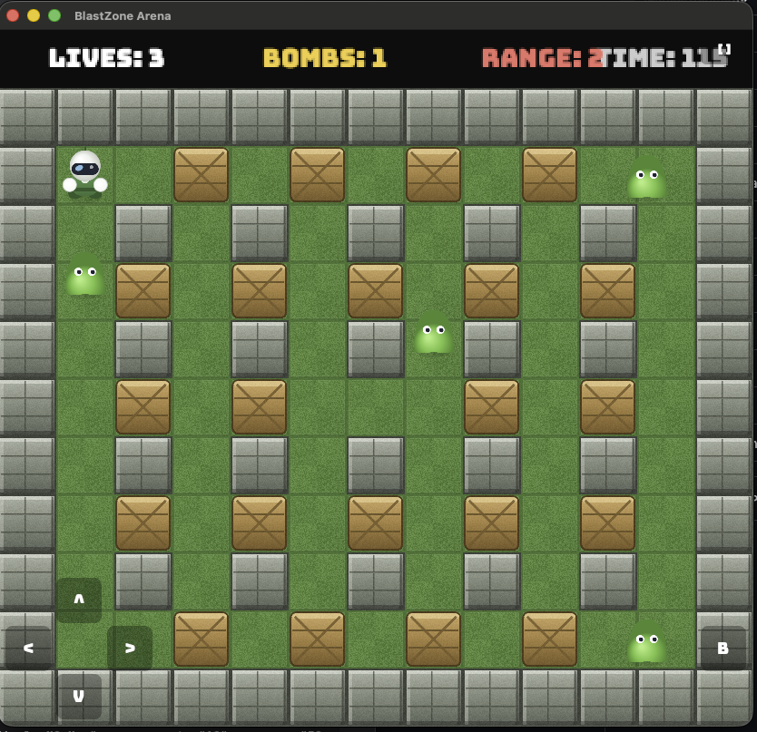
</div>

---

## Gameplay

Place bombs, chain explosions, collect power-ups, and eliminate all enemies to clear each arena.

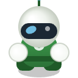 &nbsp;
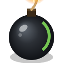 &nbsp;
 &nbsp;
 &nbsp;
 &nbsp;
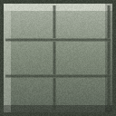

| Key | Action |
|-----|--------|
| `WASD` / Arrow keys | Move |
| `Space` / `X` | Place bomb |
| `F11` | Toggle fullscreen |

**Objective** — destroy all enemies to advance to the next level. Mind your own blasts.

### Chain reactions

Bombs caught in an explosion detonate after a short 0.15 s delay, creating chain reactions
that ripple across the arena.

---

## Power-ups

Hidden inside destructible blocks. Blast a block open to reveal one.

| | Power-up | Effect |
|-|----------|--------|
| 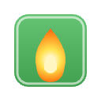 | Fire | Increases explosion range |
| 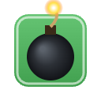 | Bomb | Adds one extra bomb you can place at once |
| 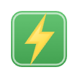 | Speed | Increases movement speed |
|  | Shield | Temporary invincibility |

---

## Themes

The visual theme changes every level, cycling through three arenas:

| Level | Theme | Floor | Wall | Block |
|-------|-------|-------|------|-------|
| 1 | 🌿 Grassland | 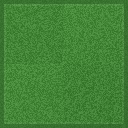 |  |  |
| 2 | 🏜 Desert | 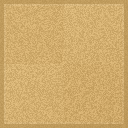 | 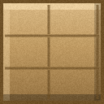 | 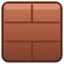 |
| 3 | ❄️ Ice |  | 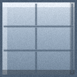 | 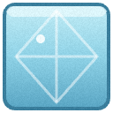 |
| 4 → | repeats | | | |

---

## Building

### Prerequisites

- [Rust](https://rustup.rs/) stable toolchain

### Native (desktop)

```sh
cargo run --release
```

### WASM (browser)

Install once:

```sh
rustup target add wasm32-unknown-unknown
cargo install wasm-bindgen-cli --version 0.2.121 --locked
```

Build and serve:

```sh
bash build_wasm.sh
cd dist && python3 -m http.server 8080
# open http://localhost:8080
```

### Linux — system dependencies

```sh
sudo apt-get install -y \
  libasound2-dev libudev-dev libx11-dev libxi-dev \
  libxcursor-dev libxrandr-dev libxinerama-dev \
  libgl1-mesa-dev libglu1-mesa-dev pkg-config
```

---

## Releases

Releases are created automatically via [release-please](https://github.com/googleapis/release-please)
on every merge to `main`. Each release publishes pre-built binaries for all platforms:

| Platform | Artifact |
|----------|----------|
| macOS Apple Silicon | `blastzone-arena-aarch64.dmg` |
| macOS Intel | `blastzone-arena-x86_64.dmg` |
| Linux x86\_64 | `blastzone-arena-linux-x86_64.tar.gz` |
| Windows x86\_64 | `blastzone-arena-windows-x86_64-setup.exe` |
| Web (WASM) | `blastzone-arena-wasm.zip` |

macOS builds are ad-hoc signed by default. Add the following repository secrets
to enable full Apple notarization:

| Secret | Purpose |
|--------|---------|
| `APPLE_CERTIFICATE_BASE64` | Developer ID certificate (base64) |
| `APPLE_CERTIFICATE_PASSWORD` | Certificate passphrase |
| `APPLE_SIGNING_IDENTITY` | Signing identity string |
| `APPLE_ID` | Apple ID for notarization |
| `APPLE_APP_PASSWORD` | App-specific password |
| `APPLE_TEAM_ID` | Team ID |
| `KEYCHAIN_PASSWORD` | Temporary keychain password |

---

## Project structure

```
src/
├── main.rs            — app setup, plugin registration
├── states.rs          — GameState enum, DeathPauseTimer
├── constants.rs       — tile size, speeds, timings
├── components.rs      — all ECS components and resources
├── game_assets.rs     — asset loading, ThemeAssets per visual theme
├── level.rs           — level PNG parsing, entity spawning, theme selection
├── player.rs          — input, bomb placement, animation
├── enemies.rs         — AI pathfinding, collision detection
├── bomb.rs            — fuse countdown, chain detonation, blast spawning
├── items.rs           — power-up collection, time countdown
├── physics.rs         — player movement, wall/bomb collision resolution
├── ui.rs              — main menu, HUD, death screen, level-complete screen
├── audio.rs           — music and sound effect playback
├── camera.rs          — orthographic camera with letterbox scaling
├── fullscreen.rs      — F11 / on-screen button fullscreen toggle
└── touch_controls.rs  — on-screen d-pad and bomb button for mobile

assets/
├── levels/            — lvl1–lvl4.png  (colour-coded arena maps, 13×11 px)
├── sprites/
│   ├── grassland/     — tiles, characters, bombs, explosions, power-ups
│   ├── desert/        — same set, desert palette
│   └── ice/           — same set, ice palette
├── audio/             — WAV sound effects and music
└── fonts/             — font.ttf

installer/             — NSIS script for the Windows installer
build_wasm.sh          — WASM build and packaging script
```

### Level format

Levels are tiny PNG images (13 × 11 pixels — one pixel per grid cell):

| Colour | Cell |
|--------|------|
| `#000000` |  Indestructible wall |
| `#ffffff` |  Open floor |
| `#00c800` |  Player spawn |
| `#ff0000` |  Enemy spawn |
| `#964b00` |  Destructible block |
| `#ffff00` |  Destructible block with hidden power-up |

---

## License

MIT — see `LICENSE` if present, otherwise treat all source code as MIT licensed.
